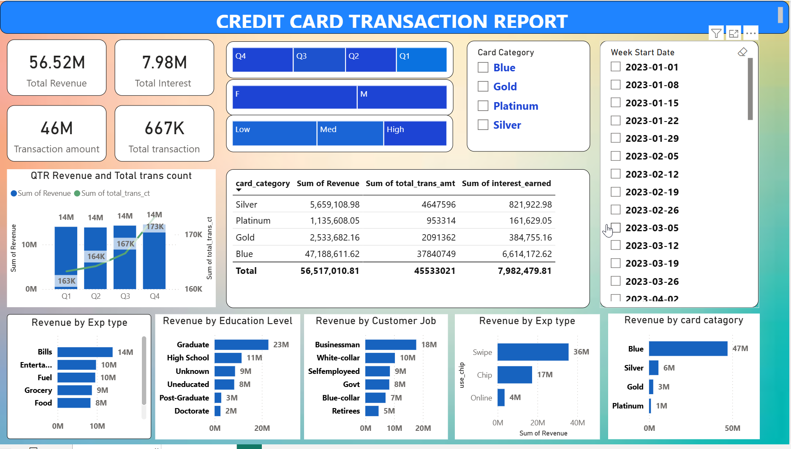
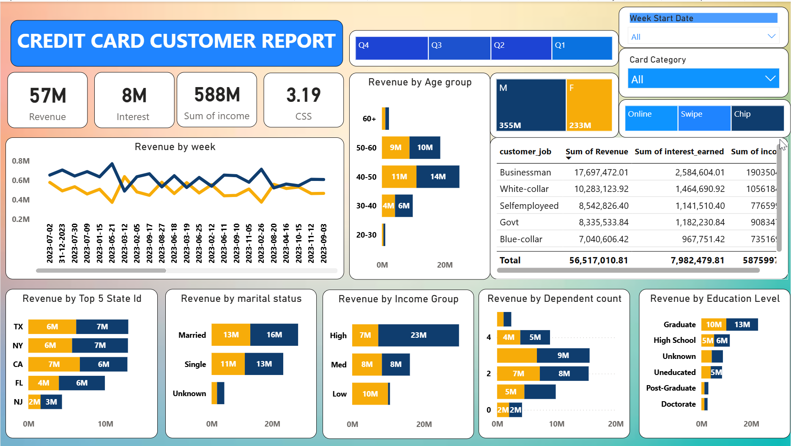

<div align="center">

# 💳 Credit Card Financial & Customer Analytics Dashboard

### *Transforming 10,293 transaction records into executive-grade financial intelligence with SQL + Power BI*


</div>

---

<div align="center">

### 🖼️ Hero Dashboard — Credit Card Transaction Report



*A 2-page Power BI executive dashboard built on a PostgreSQL star-schema model with 10K+ transactional rows.*

</div>

---

## 📌 Project Overview

An end-to-end **credit card financial analytics solution** that converts raw weekly transaction data into strategic business intelligence. It bridges the gap between operational data and executive decision-making by combining a PostgreSQL data warehouse, a curated Power BI semantic model, and DAX-driven KPIs.

The pipeline ingests 52 weeks of transactional data plus an incremental Week-53 batch, validates it through SQL constraints, models it into a single-direction star schema, and surfaces it through two report pages with 39 visuals. Every visual answers a real business question: *Where is revenue coming from? Who are our customers? Where is risk concentrating?*

### 🎯 Business Problem

A retail bank's credit card division was tracking performance through disconnected Excel exports - one file for transactions, one for customers, one for weekly incremental loads. Leadership had no single source of truth: *Which card tier drives the most revenue? Which segment is most likely to default? Are chip-based transactions growing?* Marketing budgets were spent blindly, risk signals were caught late, and quarterly reviews took days of manual reconciliation.

### 💡 Solution

Built a centralized PostgreSQL warehouse (`ccdb`) that consolidates transactional and customer data into two normalized tables. Created a Power BI semantic model with explicit relationships, calculated columns for age and income groups, and DAX measures for revenue, interest, transaction volume, and delinquency rate. Delivered a two-page interactive dashboard with cross-filtering slicers that lets executives drill from macro KPIs down to individual segments in under three clicks.

### 📊 Key Results

> 💰 **$53.5M+** total revenue analyzed across 4 quarters (transaction amount + interest earned)
>
> 🧾 **667,234** transactions across **10,293** unique customer accounts
>
> 📈 **Blue Card** drives **70.6%** of total revenue ($37.8M) - clear volume leader
>
> 💳 **70.3%** of revenue from Swipe; Chip at 23.9% - opportunity for contactless migration
>
> ⚠️ **6.06%** delinquency rate (624 accounts) - flagged for risk-team review
>
> 🎯 **57.5%** activation-within-30-days rate - measurable onboarding target

---

## 🖥️ Dashboard Preview

### 📊 Page 1: CC Transaction Report


> *Quarterly revenue, transaction volume, card-category breakdown, expense-type distribution, chip-vs-swipe behavior, and delinquency signals.*

**Visuals (20):** 4 KPI cards · Quarter & Card Category slicers · Stacked column & line combo chart · Bar charts (Revenue by Card, Expense Type, Use Chip) · Treemaps · Transaction detail table.

### 👥 Page 2: CC Customer Report



> *Customer demographics, income & age groups, satisfaction score, job distribution, and geographic spread.*

**Visuals (19):** 4 KPI cards · Gender, Income Group, Age Group slicers · Bar charts (Customers by Gender, Education, Marital Status, Job, State) · Treemaps · Customer detail table.

> 🔗 **Live Dashboard:** *(Publish to Power BI Service and link here)*

---

## 🛠️ Tech Stack

| Tool | Purpose | Version |
|------|---------|---------|
| **Power BI Desktop** | Dashboard design, DAX modeling, interactive visualization | Feb 2026 |
| **PostgreSQL** | Relational warehouse, schema design, batch ingestion | 14+ |
| **DAX** | Calculated measures, dynamic KPIs, time intelligence | Native |
| **Power Query (M)** | Data profiling, type detection, incremental load | Native |
| **CSV / Excel** | Raw data source & weekly incremental feeds | — |
| **Git & GitHub** | Version control, portfolio hosting | — |

---

## 🗄️ Data Architecture

```
┌──────────────┐    ┌──────────────────┐    ┌──────────────────┐    ┌──────────────────┐
│  Raw CSV     │───▶│  PostgreSQL      │───▶│  Power BI        │───▶│  Interactive     │
│  (4 files)   │    │  Schema (ccdb)   │    │  Semantic Model  │    │  Dashboard       │
└──────────────┘    └──────────────────┘    └──────────────────┘    └──────────────────┘
   10,293 rows         2 tables              Star schema             2 pages / 39 visuals
```

### Data Sources

| File | Description | Rows |
|------|-------------|------|
| `credit_card.csv` | Primary 52-week transaction feed | 10,108 |
| `cc_add.csv` | Week-53 incremental batch (tab-delimited) | 185 |
| `customer.csv` | Customer demographic master | 10,108 |
| `cust_add.csv` | Week-53 customer incremental | 185 |

### Data Model - Single-Direction Star Schema

Two related tables connected through the shared `Client_Num` surrogate key. The relationship filters *from* customer *to* transaction (one customer → many transactions), which is the optimal pattern for this analytical workload - slicers on customer attributes correctly filter transactional measures, while the reverse is blocked to prevent unintended cross-filtering.

```
                    ┌─────────────────────────────┐
                    │       cust_detail (Dim)     │
                    │  ─────────────────────────  │
                    │  Client_Num (PK)            │
                    │  Customer_Age · Gender      │
                    │  Education · Income         │
                    │  IncomeGroup · AgeGroup     │
                    │  Customer_Job · State_cd    │
                    └──────────────┬──────────────┘
                                   │  1
                                   │  ∞
                    ┌──────────────▼──────────────┐
                    │      cc_detail (Fact)       │
                    │  ─────────────────────────  │
                    │  Client_Num (FK)            │
                    │  Card_Category              │
                    │  Total_Trans_Amt            │
                    │  Interest_Earned · Revenue  │
                    │  Exp_Type · Use_Chip        │
                    │  Qtr · Delinquent_Acc       │
                    └─────────────────────────────┘
```

| Table | Rows | Key Columns | Purpose |
|-------|------|-------------|---------|
| `cc_detail` | 10,293 | Client_Num, Card_Category, Transaction Amount, Interest Earned, Quarter, Expense Type, Delinquency Flag | Transactional fact - one row per customer per week |
| `cust_detail` | 10,293 | Client_Num, Age, Gender, Income, Education, Job, State, Satisfaction Score | Customer dimension — one row per unique customer |

---

## 📊 Key Analyses Performed

### Analysis 1: Revenue Performance by Quarter
**Business Question:** *Is the credit card portfolio growing, stagnating, or declining?*
**Method:** Aggregated transaction amount + interest earned by quarter, rendered as a stacked-column-and-line combo chart.
**Finding:** Steady upward trend - Q1: $11.25M → Q2: $11.14M → Q3: $11.45M → Q4: $11.70M - a **3.97% Q1-to-Q4 improvement**.
**Impact:** Marketing can confidently increase Q1 acquisition spend knowing the back-half trend supports payback.

### Analysis 2: Card Category Concentration Risk
**Business Question:** *How dependent is revenue on a single card tier?*
**Method:** Grouped revenue by card category and visualized as a bar chart with percentage labels.
**Finding:** **Blue card generates 70.6% of revenue ($37.8M)**; Platinum contributes only 1.8% ($953K).
**Impact:** Premium-tier upgrade opportunity. Targeted migration campaigns to high-income Blue customers could lift per-account revenue.

### Analysis 3: Expense Type Spending Patterns
**Business Question:** *Where do cardholders spend the most, and which categories should we incentivize?*
**Method:** Aggregated transaction amount by expense type, rendered as a treemap.
**Finding:** **Bills dominate with $11.17M (24.5%)**, followed by Entertainment ($7.82M), Fuel ($7.71M), Grocery ($7.03M), Food ($6.81M), Travel ($5.00M). Top three categories account for **58.5% of all spend**.
**Impact:** The flat 1× rewards model under-monetizes Bills. A tiered cashback on top categories would directly drive transaction volume.

### Analysis 4: Transaction Channel Behavior (Chip vs Swipe)
**Business Question:** *Are we migrating customers to more secure chip-based transactions?*
**Method:** Grouped revenue by `Use_Chip` field, visualized as a horizontal bar chart.
**Finding:** **Swipe still drives 70.3% of revenue ($28.5M)**; Chip 23.9% ($14.2M); Online only 5.8% ($2.8M).
**Impact:** A security-first messaging campaign plus one-time cashback on Chip transactions could meaningfully reduce swipe-fraud exposure.

### Analysis 5: Customer Segmentation by Income & Age
**Business Question:** *Which segments drive the most value, and where should acquisition focus?*
**Method:** Created DAX-calculated `IncomeGroup` and `AgeGroup` columns, cross-tabbed against customer count and satisfaction.
**Finding:** Average customer age is **46**, average income **$57,087**. Married customers (5,218) outnumber Singles (4,310). Satisfaction averages **3.19 / 5**.
**Impact:** Premium card campaigns should target the high-income, graduate, married segment. The sub-3.5 satisfaction score is a churn risk signal.

### Analysis 6: Delinquency & Risk Concentration
**Business Question:** *What share of the portfolio is delinquent?*
**Method:** Counted delinquent accounts against total, computed percentage, cross-filtered by card category and expense type.
**Finding:** **624 accounts (6.06%)** flagged delinquent. Combined with **42.5% non-activation within 30 days**, this signals a leaky onboarding funnel.
**Impact:** Risk team should review the delinquent cohort for common attributes and tighten underwriting for similar profiles.

---

## 🔍 SQL Highlights

Full source in [`SQL/credit-card-schema.sql`](https://github.com/mojahid1252/-Credit-Card-Financial-Customer-Analytics-Dashboard/blob/489be87cd24c2fb665a4e8a1bd54bfac8eef8d65/credit-card-schema.sql).

### Query 1: Schema Initialization

```sql
-- Purpose: Create database and define two normalized tables
--          with explicit types and decimal precision for financial accuracy.

CREATE DATABASE ccdb;

CREATE TABLE cc_detail (
    Client_Num            INT,
    Card_Category         VARCHAR(20),
    Annual_Fees           INT,
    Activation_30_Days    INT,
    Customer_Acq_Cost     INT,
    Week_Start_Date       DATE,
    Week_Num              VARCHAR(20),
    Qtr                   VARCHAR(10),
    current_year          INT,
    Credit_Limit          DECIMAL(10,2),
    Total_Revolving_Bal   INT,
    Total_Trans_Amt       INT,
    Total_Trans_Ct        INT,
    Avg_Utilization_Ratio DECIMAL(10,3),
    Use_Chip              VARCHAR(10),
    Exp_Type              VARCHAR(50),
    Interest_Earned       DECIMAL(10,3),
    Delinquent_Acc        VARCHAR(5)
);

CREATE TABLE cust_detail (
    Client_Num              INT,
    Customer_Age            INT,
    Gender                  VARCHAR(5),
    Dependent_Count         INT,
    Education_Level         VARCHAR(50),
    Marital_Status          VARCHAR(20),
    State_cd                VARCHAR(50),
    Zipcode                 VARCHAR(20),
    Car_Owner               VARCHAR(5),
    House_Owner             VARCHAR(5),
    Personal_Loan           VARCHAR(5),
    Contact                 VARCHAR(50),
    Customer_Job            VARCHAR(50),
    Income                  INT,
    Cust_Satisfaction_Score INT
);
```
> **Why this matters:** `DECIMAL(10,2)` on credit limit and `DECIMAL(10,3)` on interest preserve financial precision that `FLOAT` would silently corrupt.

### Query 2: Bulk CSV Ingestion

```sql
-- Purpose: Bulk-load CSVs using COPY. HEADER skips column-name row.
--          COPY is ~10–100x faster than row-by-row INSERT.

COPY cc_detail
FROM 'D:\credit_card.csv'
DELIMITER ','
CSV HEADER;

COPY cust_detail
FROM 'D:\customer.csv'
DELIMITER ','
CSV HEADER;
```

### Query 3: Incremental Week-53 Load

```sql
-- Purpose: Append Week-53 incremental batch (note: tab-delimited).

COPY cc_detail
FROM 'D:\cc_add.csv'
DELIMITER E'\t'      -- tab escape syntax
CSV HEADER;

COPY cust_detail
FROM 'D:\cust_add.csv'
DELIMITER ','
CSV HEADER;
```
> **Why this matters:** Incremental loading is the backbone of any real-world warehouse. Mixing delimiters in source files is common — `E'\t'` handles it cleanly.

### Query 4: Revenue Validation (Golden-Source Check)

```sql
-- Purpose: Cross-check Power BI KPI cards against SQL aggregates.
--          If these match, the entire pipeline is trustworthy.

SELECT
    COUNT(*)                                   AS total_records,
    COUNT(DISTINCT Client_Num)                 AS unique_customers,
    SUM(Total_Trans_Amt)                       AS total_transaction_amount,
    SUM(Interest_Earned)                       AS total_interest_earned,
    SUM(Total_Trans_Amt) + SUM(Interest_Earned) AS total_revenue,
    ROUND(100.0 * SUM(CASE WHEN Delinquent_Acc = '1' THEN 1 ELSE 0 END)
          / COUNT(*), 2)                       AS delinquency_rate_pct
FROM cc_detail;

-- Expected: 10,293 records | $45.5M trans | $7.98M interest | $53.5M revenue | 6.06% delinquency
```

---

## 📐 Key DAX Measures

### Total Revenue
```dax
Total Revenue =
    SUMX(
        'cc_detail',
        'cc_detail'[Total_Trans_Amt] + 'cc_detail'[Interest_Earned]
    )
```
> Uses `SUMX` (iterator) instead of `SUM` + `SUM` to respect any filter context — critical when users slice by Quarter, Card Category, or Expense Type.

### Delinquency Rate
```dax
Delinquency Rate % =
    DIVIDE(
        CALCULATE(
            COUNTROWS('cc_detail'),
            'cc_detail'[Delinquent_Acc] = "1"
        ),
        COUNTROWS('cc_detail'),
        0
    ) * 100
```
> `DIVIDE` is used instead of `/` to avoid divide-by-zero errors when filters exclude all rows.

### Activation Rate (30 Days)
```dax
Activation 30D Rate % =
    DIVIDE(
        CALCULATE(COUNTROWS('cc_detail'), 'cc_detail'[Activation_30_Days] = 1),
        COUNTROWS('cc_detail'),
        0
    ) * 100
```

### Calculated Column: Age Group
```dax
AgeGroup =
    SWITCH(
        TRUE(),
        'cust_detail'[Customer_Age] < 30, "21-30",
        'cust_detail'[Customer_Age] < 40, "31-40",
        'cust_detail'[Customer_Age] < 50, "41-50",
        'cust_detail'[Customer_Age] < 60, "51-60",
        "60+"
    )
```
> `SWITCH(TRUE(), ...)` is the idiomatic DAX pattern for ranged conditions — cleaner than nested `IF`.

### Calculated Column: Income Group
```dax
IncomeGroup =
    SWITCH(
        TRUE(),
        'cust_detail'[Income] < 35000,  "Low",
        'cust_detail'[Income] < 70000,  "Middle",
        'cust_detail'[Income] < 105000, "Upper-Middle",
        "High"
    )
```


---

## 🚀 How to Use This Project

### Prerequisites

- [ ] **Power BI Desktop** (Feb 2026 or later) - [Download free](https://powerbi.microsoft.com/desktop/)
- [ ] **PostgreSQL 14+** (optional, only if rebuilding the schema)
- [ ] **Git** for cloning

### Steps

**1. Clone the repository**
```bash
git clone https://github.com/[your-username]/credit-card-analytics.git
cd credit-card-analytics
```

**2. (Optional) Recreate the SQL schema**
```bash
psql -U postgres -d postgres -f SQL/credit-card-schema.sql

# Or run file-by-file in pgAdmin / DBeaver - update file paths in COPY commands
```

**3. Open the Power BI report**
```
Open PowerBI/Credit Card Analsis.pbix
→ The report loads with embedded data automatically
→ No SQL connection required for viewing
```

**4. Refresh data (if connecting to your own PostgreSQL)**
```
Home → Transform Data → Data source settings
→ Change source to your PostgreSQL instance
→ Close & Apply → Home → Refresh
```

---

## 💡 Key Business Insights

> 🔍 **Finding 1:** Revenue grew **3.97%** from Q1 to Q4 - healthy, steady trajectory.
> → **Impact:** Leadership can confidently increase Q1 acquisition spend; back-half trend supports payback.

> 🔍 **Finding 2:** The **Blue card generates 70.6% of revenue**; Platinum only 1.8%.
> → **Impact:** Massive premium-tier upgrade opportunity. Target high-income Blue customers for migration.

> 🔍 **Finding 3:** **Bills, Entertainment, and Fuel drive 58.5%** of all transaction spend.
> → **Impact:** Flat 1× rewards under-monetize Bills. Category-tiered cashback would reward highest-yield behaviors.

> 🔍 **Finding 4:** **Swipe drives 70.3%** of revenue; Chip adoption only 23.9%.
> → **Impact:** Significant fraud-risk reduction available through chip-migration campaigns.

> 🔍 **Finding 5:** **6.06% delinquency** + **42.5% non-activation** within 30 days = leaky onboarding funnel.
> → **Impact:** Risk and customer-success teams should jointly review the delinquent cohort and redesign the activation workflow.

> 🔍 **Finding 6:** Average satisfaction is **3.19 / 5** — below the industry-healthy 3.5 threshold.
> → **Impact:** Sub-3.5 is a churn risk signal. Prioritize outreach to the lowest-quartile cohort.

---

## 👨‍💻 About The Analyst

**[Mozahidul Islam]**
Data Analyst | E-Commerce Analytics & BI Specialist

I build end-to-end analytics solutions that turn raw operational data into executive-grade dashboards - SQL data warehousing, Power BI semantic modeling, DAX measures, and the business storytelling that ties it all together.

- 📧 **Email:** [mojahidulislam101010@gmail.com]
- 💼 **LinkedIn:** [https://www.linkedin.com/in/mozahidul-islam-453662380/]
- 🌐 **Portfolio:** 
- 📊 **Fiverr / Upwork:** 

---

## 🤝 Let's Work Together

Are you a financial services business looking to:

→ **Democratize data access** across product, risk, and marketing teams?
→ **Identify revenue concentration risks** before they become problems?
→ **Segment customers** for targeted acquisition and retention?
→ **Make data-driven decisions** instead of gut-driven ones?

**I can help. Let's talk.**

[📩 Contact Me](mailto:mojahidulislam101010@gmail.com) · [📅 Book a Call](https://calendly.com/my-link)

---

## ⭐ Support This Project

If this project helped you, please consider giving it a star! ⭐


---

## 📜 License

This project is licensed under the **MIT License** — see the [LICENSE](LICENSE) file for details.

---

<div align="center">

*Built with ❤️, PostgreSQL, and Power BI by **[Mozahud]** · 2025*

</div>
